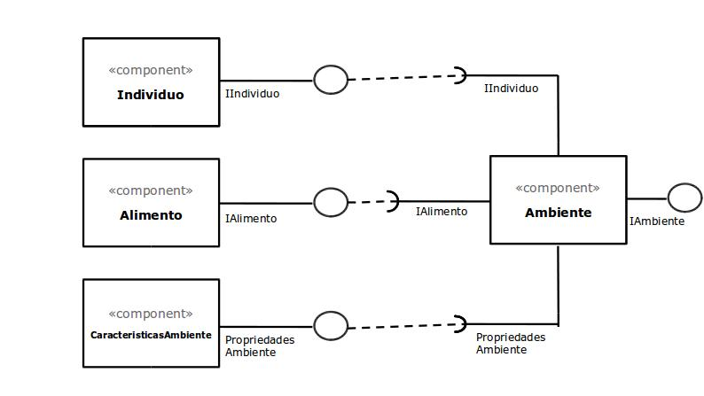

# Projeto 'Simulação Simples de Seleção Natural'

# Equipe
* Gustavo de Souza dos Reis - 217425
* Nicolas Bissoli Nattis - 222903

# Descrição Resumida do Projeto
O projeto visa criar uma simulação na qual é possivel, de forma simplificada, observar como a seleção natural agiria sobre certos indivíduos a partir de características inicialmente estabelecidas.

[Descrição do projeto em vídeo](https://youtu.be/5YG_XTaacII)

# Componentes
* [Individuo](docs/Individuo.md)
* [Alimento](docs/Alimento.md)
* [Ambiente](docs/Ambiente.md)

# Diagrama Geral de Componentes

