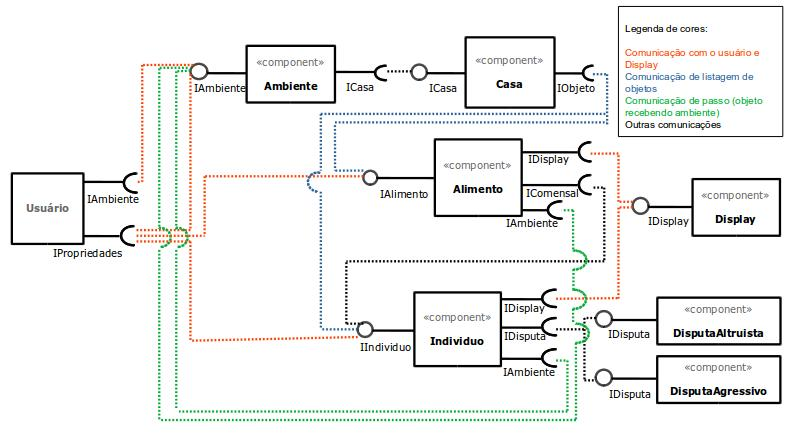
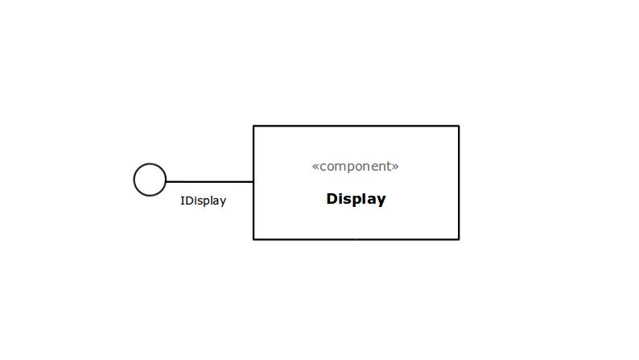
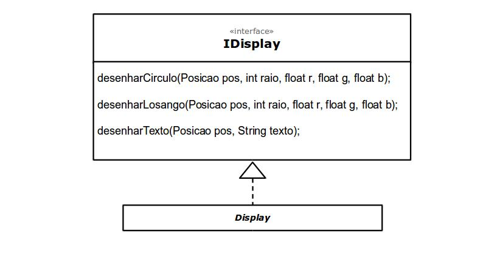
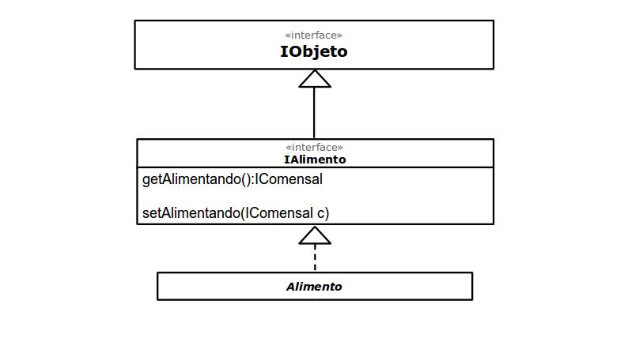
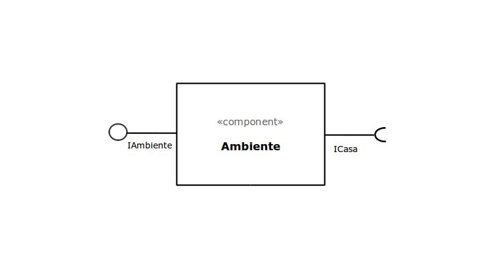
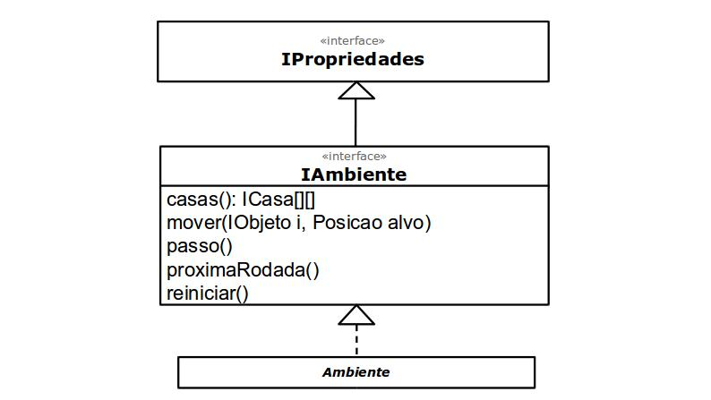
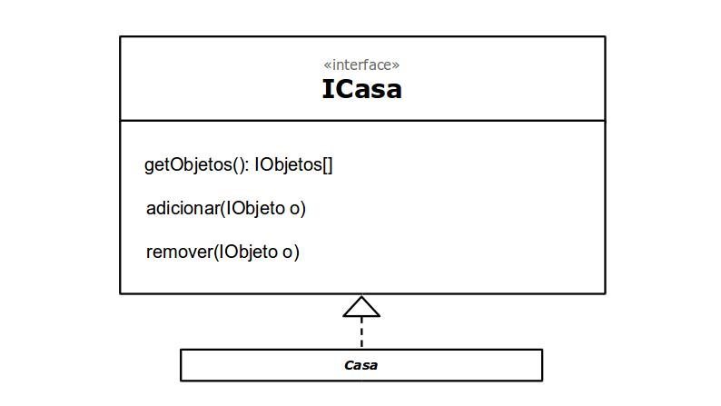
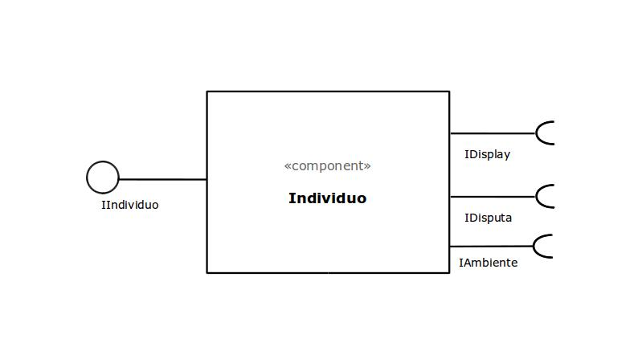
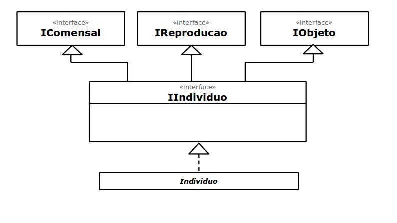
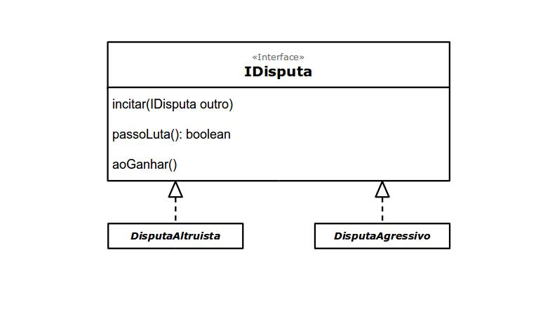

# Projeto 'Simulação Simples de Seleção Natural'

# Descrição Resumida do Projeto
O projeto visa criar uma simulação na qual é possivel, de forma simplificada, observar como a seleção natural agiria sobre certos indivíduos a partir de características inicialmente estabelecidas.

# Equipe
* Gustavo de Souza dos Reis - 217425
* Nicolas Bissoli Nattis - 222903

# Vídeos do Projeto

## Vídeo da Prévia
> [Descrição do projeto em vídeo](https://youtu.be/5YG_XTaacII)

## Vídeo do Jogo
> <Coloque um link para o vídeo em que é demonstrada a versão final do jogo. Esse vídeo deve ter em torno de 5 minutos. Este vídeo não apresenta slides, nem substitui a apresentação final do projeto, que será feita por conferência. Ele mostra apenas o jogo em funcionamento.>

# Slides do Projeto

## Slides da Prévia
[Apresentação do projeto](https://docs.google.com/presentation/d/1VNRqjlXSO0DlfJKghyU4DFAkQsdF8YDgi9pIIya53mk/edit?usp=sharing)

## Slides da Apresentação Final
`<Coloque um link para os slides da apresentação final do projeto.>`

## Relatório de Evolução

> <Relatório de evolução, descrevendo as evoluções do design do projeto, dificuldades enfrentadas, mudanças de rumo, melhorias e lições aprendidas. Referências aos diagramas e recortes de mudanças são bem-vindos.>

# Destaques de Código

> <Escolha trechos relevantes e/ou de destaque do seu código. Apresente um recorte (você pode usar reticências para remover partes menos importantes). Veja como foi usado o highlight de Java para o código.>

~~~java
// Recorte do seu código
public void algoInteressante(…) {
   …
   trechoInteressante = 100;
}
~~~

# Destaques de Pattern
`<Destaque de patterns adotados pela equipe. Sugestão de estrutura:>`

## Diagrama do Pattern
`<Diagrama do pattern dentro do contexto da aplicação.>`

## Código do Pattern
~~~java
// Recorte do código do pattern seguindo as mesmas diretrizes de outros destaques
public void algoInteressante(…) {
   …
   trechoInteressante = 100;
}
~~~

> <Explicação de como o pattern foi adotado e quais suas vantagens, referenciando o diagrama.>

# Diagramas

## Diagrama Geral de Componentes

> 

> No diagrama apresentado, podemos ver como os componentes se comunicam entre si, e também como é feita a comunicação com o usuário

## Detalhamento Componentes

## Componente `Display`

> Componente responsável pela interface gráfica do programa.

**Ficha Técnica**
item | detalhamento
----- | -----
Classe | `<caminho completo da classe com pacotes>`   Exemplo: `pt.c08componentes.s20catalog.s10ds.DataSetComponent`
Autores | Nicolas e Gustavo
Interfaces | IDisplay

### Interfaces

Interfaces associadas a esse componente:

Interface agregadora do componente em Java:

~~~java
public interface IDisplay {
}
~~~
## Componente `Alimento`

> Tipo de objeto que fornece energia para o indivíduo e que pode gerar uma disputa

**Ficha Técnica**
item | detalhamento
----- | -----
Classe | `<caminho completo da classe com pacotes>`   Exemplo: `pt.c08componentes.s20catalog.s10ds.DataSetComponent`
Autores | Nicolas e Gustavo
Interfaces | IAlimento

### Interfaces

Interfaces associadas a esse componente:

Interface agregadora do componente em Java:

~~~java
public interface IAlimento extends IObjeto {
}
~~~

## Componente `Ambiente`

> Meio celular no qual ocorrem as interações entre os demais componentes

**Ficha Técnica**
item | detalhamento
----- | -----
Classe | `<caminho completo da classe com pacotes>`   Exemplo: `pt.c08componentes.s20catalog.s10ds.DataSetComponent`
Autores | Nicolas e Gustavo
Interfaces | IAmbiente

### Interfaces

Interfaces associadas a esse componente:

Interface agregadora do componente em Java:

~~~java
public interface IAmbiente extends IPropriedades {
}
~~~

## Componente `Casa`

> Espaço no qual pode haver um objeto ou estar vazio

**Ficha Técnica**
item | detalhamento
----- | -----
Classe | `<caminho completo da classe com pacotes>`   Exemplo: `pt.c08componentes.s20catalog.s10ds.DataSetComponent`
Autores | Nicolas e Gustavo
Interfaces | ICasa

### Interfaces

Interfaces associadas a esse componente:

Interface agregadora do componente em Java:

~~~java
public interface ICasa {
}
~~~

## Componente `Individuo`

> Um tipo de objeto no qual o projeto se baseia, sendo importante as interações entre diferentes indivíduos

**Ficha Técnica**
item | detalhamento
----- | -----
Classe | `<caminho completo da classe com pacotes>`   Exemplo: `pt.c08componentes.s20catalog.s10ds.DataSetComponent`
Autores | Nicolas e Gustavo
Interfaces | IIndividuo

### Interfaces

Interfaces associadas a esse componente:

Interface agregadora do componente em Java:

~~~java
public interface IIndividuo extends IObjeto, IComensal, IReproducao {
}
~~~

## Componentes `DisputaAgressivo DisputaAltruista`

>Componentes relacionados à disputa por um objeto, que podem ser agressivas, na qual um dos interagentes é eliminado, e altruista, na qual um dos interagentes cede o objeto disputado

[Disputa](docs/ComponenteDisputa.jpg)

**Ficha Técnica**
item | detalhamento
----- | -----
Classe | `<caminho completo da classe com pacotes>`   Exemplo: `pt.c08componentes.s20catalog.s10ds.DataSetComponent`
Autores | Nicolas e Gustavo
Interfaces | IDisputa

### Interfaces

Interfaces associadas a esse componente:

Interface agregadora do componente em Java:

~~~java
public interface IDisputa{
}
~~~

## Detalhamento das Interfaces

### Interface `IDisplay`

`Interface responsável pelo visual gráfico do programa`

~~~java
public interface IDisplay{

   public desenharCirculo(Posicao pos, int raio, float r, float g, float b);
   public desenharLosango(Posicao pos, int raio, float r, float g, float b);
   public desenharTexto(Posicao pos, String texto);
   
}
~~~

Método | Objetivo
-------| --------
`desenharCirculo` | `Cria um circulo com um certo raio, em uma certa posição, com as cores dadas a partir das variáveis rgb`
`desenharLosango` | `Cria um losango com um certo lado, em uma certa posição, com as cores dadas a partir das variáveis rgb`
`desenharTexto` | `Cria um texto em uma certa posição dada`

# Plano de Exceções

## Diagrama da hierarquia de exceções
`<Elabore um diagrama com a hierarquia de exceções como detalhado abaixo>`

## Descrição das classes de exceção

`<Monte uma tabela descritiva seguindo o exemplo>:`

Classe | Descrição
----- | -----
DivisaoInvalida | Engloba todas as exceções de divisões não aceitas.
DivisaoInutil | Indica que a divisão por 1 é inútil.
DivisaoNaoInteira | Indica uma divisão não inteira.

# Componentes

* [CDisplay](docs/CDisplay.md)
* [CCasa](docs/CCasa.md)
* [CAmbiente](docs/CAmbiente.md)
* [CAlimento](docs/CAlimento.md)
* [CIndividuo](docs/CIndividuo.md)
  * [CComensal](docs/CComensal.md)
  * [CDisputa](docs/CDisputa.md)
  * [CReproducao](docs/CReproducao.md)

# Classes

* [Gene](docs/Gene.md)
* [Posicao](docs/Posicao.md)

# Diagrama Geral de Componentes

