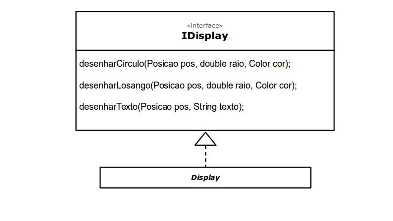

# Projeto 'Simulação Simples de Seleção Natural'
***
# Descrição Resumida do Projeto
O projeto visa criar uma simulação na qual é possivel, de forma simplificada, observar como a seleção natural agiria sobre certos indivíduos a partir de características inicialmente estabelecidas.

# Equipe
* Gustavo de Souza dos Reis - 217425
* Nicolas Bissoli Nattis - 222903

# Sumário

* [Apresentação do Projeto](#vídeos)
* [Diagrama de Componentes](#diagramas)
* [Interfaces](#detalhamento-das-interfaces)
* [Plano de Exceções](#tratamento-de-erros)

# Vídeos

## Vídeo da Prévia
> [Descrição do projeto em vídeo](https://youtu.be/5YG_XTaacII)

## Vídeo do Jogo
> [Demonstração](https://www.youtube.com/watch?v=t_VHFi2_rmk&feature=youtu.be)

# Slides do Projeto

## Slides da Prévia
[Apresentação do projeto](https://docs.google.com/presentation/d/1VNRqjlXSO0DlfJKghyU4DFAkQsdF8YDgi9pIIya53mk/edit?usp=sharing)

## Slides da Apresentação Final
[Apresentação Final](https://docs.google.com/presentation/d/1heejW5oTk09ieW_NVZAlWw2QEAfHzoUBBJQ8FNtxT6M/edit?usp=sharing)
## Relatório de Evolução

* A evolução e execução do projeto pode ser dividida em 3 etapas: planejamento, execução e finalização.

   * Planejamento:  Nessa etapa procuramos esclarecer exatamente os objetivos       do projeto, e quais os meios que teriamos para alcançar esses objetivos. Determinamos como seria a apresentação visual do projeto, com quais elementos o usuário  pode interagir, qual a melhor forma de realizar essas interações, quais características do sistema como um todo seriam customizaveis, e qual a melhor forma de    organizar isso. Além disso definimos quais seriam os "mecanismos internos" do projeto, quais interfaces seriam criadas, e quais componentes essas interfaces   poderiam gerar, além de como se daria a comunicação interna entre os componentes, e como se daria a comunicação externa com o usuário.
   
   * Execução: Na execução procuramos ser o mais fiel possível ao que foi planejado, porém algumas coisas tiveram que ser mudadas, e para continuar mantendo o controle, criamos um documento no qual fomos listando todas as mudanças que precisaram ser feitas no projeto original. Dessas mudanças pode-se citar a adoção de um sistema diferente de gerenciamento de propriedades, o refatoramento de alguns componentes e até mesmo de algumas interfaces.
   
   * Finalização: Nessa etapa, buscamos fazer ajustes finais ao projeto como um todo, atualizando, no planejamento, as mudanças listadas durante a execução do projeto, e fazendo testes no programa para localizar e tratar possíveis bugs.

# Destaques de Código

> O trecho abaixo merece destaque pois é a forma com que uma nova rodada da simulação é inicializada. Nela, podemos ver que primeiro há a reprodução daqueles indivíduos considerados aptos a tal ação, depois posiciona todos nas bordas e cria novos individuos aleatórios até atingir a quantidade estabelecida pelo usuário e por fim, adiciona um certo número de alimentos em espaços vagos aleatórios. 

~~~java
private void comecarRodada() {
        int novos = 0;

        while (mSobreviventes.size() >= 2) {
            IIndividuo ind1 = mSobreviventes.remove(0);

            IIndividuo[] disponiveis = new IIndividuo[mSobreviventes.size()];
            mSobreviventes.toArray(disponiveis);

            int id = ind1.escolherParceiro(disponiveis);
            IIndividuo ind2 = mSobreviventes.remove(id);

            Gene gene = ind2.aoReproduzir(ind1);
            IDisputa disputa = gene.altruismo >= mMinimoAltruismoParaAltruista.get() ? new DisputaAltruista()
                    : new DisputaAgressivo();
            adicionar(new Individuo(posicaoNaBordaAleatoriaVaga(), disputa, gene, mCustoMov.get(),
                    mEnergiaInicialIndividuo.get()));

            ind1.updatePosicao(posicaoNaBordaAleatoriaVaga());
            ind1.perderEnergia(this, mEnergiaRepro.get());
            adicionar(ind1);
            ind2.updatePosicao(posicaoNaBordaAleatoriaVaga());
            ind2.perderEnergia(this, mEnergiaRepro.get());
            adicionar(ind2);

            novos += 3;
        }
        if (mSobreviventes.size() == 1) {
            IIndividuo ind1 = mSobreviventes.remove(0);
            ind1.updatePosicao(posicaoNaBordaAleatoriaVaga());
            adicionar(ind1);

            novos += 1;
        }

        if (novos < mRepopularCom.get())
            for (int i = 0; i < mRepopularCom.get() - novos; i++)
                adicionarIndividuoEm(posicaoNaBordaAleatoriaVaga());

        for (int i = 0; i < mAlimentoPorRodada.get(); i++)
            adicionarAlimentoEm(posicaoAleatoriaVaga());
    }
    
    ~~~

***
# Destaques de Pattern

## Data Access Object Pattern

### Código do Pattern
~~~java

…

public void setValue(String x) throws ErroProp {
	try {
		int y = Integer.parseInt(x);
		if (y >= mMin && y <= mMax)
			mVal = y;
		else
			throw new ErroPropForaDeAlcance("A propriedade deve estar entre " + mMin + " e " + mMax);
	} catch (NumberFormatException e) {
		throw new ErroPropTipoInvalido("A propriedade deve ser um inteiro");
	}
}

~~~

> O Pattern em questão foi criado para padronizar as operações de acesso e modificação de dados no programa, podendo deixar essas operações acessiveis ao usuário

## Composite Pattern

### Código do Pattern
~~~java

…

public void desenharCirculo(Posicao pos, double raio, Color cor) {
	int r = (int) (raio * (double) mTamanhoCelula);

	int x = pos.x * mTamanhoCelula + mTamanhoCelula / 2 + mDeltaX - r;
	int y = pos.y * mTamanhoCelula + mTamanhoCelula / 2 + mDeltaY - r;

	mGraphics.setColor(cor);
	mGraphics.fillOval(x, y, 2 * r, 2 * r);
	}
~~~

> O Pattern em questão foi criado para generalizar a forma como as coisas serão apresentadas na tela do usuário

***
# Conclusões e Trabalhos Futuros

> Pode-se dizer que os objetivos iniciais do projeto foram alcançados. Criamos uma simulação na qual é possível observar como características de um certo individuo podem influenciar nas relações com outros indíviduos no mesmo ecossistema simulado, baseando-se em competição por alimentos e disputas pelos mesmos alimentos. Para melhorias futuras no projeto, gostaríamos de adicinar modelos estatísticos à simulação, para ter à mão dados mais concretos sobre a influência de certas características no tamanho total da população do ambiente, adicionando opções como plotagem de gráficos e criação de tabelas. Também poderíamos deixar a simulação mais complexa, implementando um sistema de características mais complexo, chance de mutação na reprodução e especiação. Além disso, podem ser criados outros tipos de Objetos, que podem ser obstáculos, por exemplo.

***
# Diagramas

## Diagrama Geral de Componentes

> 

> No diagrama apresentado, podemos ver como os componentes se comunicam entre si, e também como é feita a comunicação com o usuário

## Detalhamento Componentes

## Componente `Display`

> Componente responsável pela interface gráfica do programa.

**Ficha Técnica**
item | detalhamento
----- | -----
Classe | `com.github.gustavosr8.sssn.ui.Display`
Autores | Nicolas e Gustavo
Interfaces | IDisplay

### Interfaces

Interfaces associadas a esse componente:

Interface agregadora do componente:

[IDisplay](#interface-idisplay)

## Componente `Alimento`

> Tipo de objeto que fornece energia para o indivíduo e que pode gerar uma disputa

**Ficha Técnica**
item | detalhamento
----- | -----
Classe | `com.github.gustavosr8.sssn.alimento.Alimento`
Autores | Nicolas e Gustavo
Interfaces | IAlimento

### Interfaces

Interfaces associadas a esse componente:

Interface agregadora do componente em Java:

[IAlimento](#interface-ialimento)

## Componente `Ambiente`

> Meio celular no qual ocorrem as interações entre os demais componentes

**Ficha Técnica**
item | detalhamento
----- | -----
Classe | `com.github.gustavosr8.sssn.ambiente`
Autores | Nicolas e Gustavo
Interfaces | IAmbiente

### Interfaces

Interfaces associadas a esse componente:

Interface agregadora do componente:

[IAmbiente](#interface-iambiente)

## Componente `Individuo`

> Um tipo de objeto no qual o projeto se baseia, sendo importante as interações entre diferentes indivíduos

**Ficha Técnica**
item | detalhamento
----- | -----
Classe | `com.github.gustavosr8.sssn.individuo`	
Autores | Nicolas e Gustavo
Interfaces | IIndividuo 

### Interfaces

Interfaces associadas a esse componente:

Interface agregadora do componente:

[IIndividuo](#interface-iindividuo)

## Componentes `DisputaAgressivo / DisputaAltruista`

>Componentes relacionados à disputa por um objeto, que podem ser agressivas, na qual um dos interagentes é eliminado, e altruista, na qual um dos interagentes cede o objeto disputado

[Disputa](docs/img/ComponenteDisputa.jpg)

**Ficha Técnica**
item | detalhamento
----- | -----
Classe | `com.github.gustavosr8.sssn.individuo`
Autores | Nicolas e Gustavo	
Interfaces | IDisputa

### Interfaces

Interfaces associadas a esse componente:

Interface agregadora do componente em Java:

[IDisputa](#interface-idisputa)
***
## Detalhamento das Interfaces

### Interface `IDisplay`

`Interface responsável pelo visual gráfico do programa`

~~~java
public interface IDisplay {
	public void desenharCirculo(Posicao pos, double raio, Color cor);
	public void desenharLosango(Posicao pos, double raio, Color cor);
	public void desenharTexto(Posicao pos, String texto);
}
~~~

Método | Objetivo
-------| --------
`desenharCirculo` | `Cria um circulo com um certo raio, em uma certa posição e uma certa cor`
`desenharLosango` | `Cria um losango com um certo lado, em uma certa posiçãoe uma certa cor`
`desenharTexto` | `Cria um texto em uma certa posição dada`

### Interface `IPropHolder`

`Interface responsável pelo armazenamento de propriedades`

~~~java
public interface IPropHolder {
	public Prop[] props();
}
~~~

> Nota-se que nessa interface não há metodos, somente uma lista de objetos do tipo Prop que armazena as propriedades de um certo objeto

### Interface `IObjeto`

`Generalização dos itens que compõe o ambiente celular`

~~~java
public interface IObjeto extends IPropHolder {

	public void exibir(IDisplay display);
	public void passo(IAmbiente ambiente);
	public Posicao getPosicao();
	public void updatePosicao(Posicao f);
	public String getNome();

}
~~~

Método | Objetivo
-------| --------
`exibir` | `Exibe o objeto em questão na tela do usuário, a partir dos métodos da interface IDisplay`
`passo` | `Realiza um ciclo em um dado ambiente, e atualiza o objeto conforme for definido no ciclo`
`getPosicao` | `Retorna a posição na qual o objeto se encontra`
`updatePosicao`|`Recebe uma nova posição após um objeto ser movido, e a atualiza`
`getNome` | `Retorna o nome  do componente associado a implementação do objeto`

### Interface `IDisputa`

`Interface reponsável por gerir a disputa entre dos seres`

~~~java

public interface IDisputa {

	public void conflitar(IAmbiente ambiente, IAlimento alimentoDisputado, IComensal ind, IComensal outro);
	public void aoPediremParaCompartilhar(IAmbiente ambiente, IAlimento alimentoDisputado, IComensal ind, IComensal outro);
	public boolean passoLuta(IAmbiente ambiente, IComensal ind);
    	public Color getCor();
}

~~~

Método | Objetivo
-------| --------
`conflitar` | `Recebe um IComensal que cria um conflito com um outro IComensal, que pode ser um conflito agressivo ou altruísta, dependendo do nivel de altruísmo de ambos`
`aoPediremParaCompartilhar` | ` Dois "Icomensal" partilham um alimento caso ambos sejam altruístas, e isso é gerenciado nesse método`
`passoLuta` | `Realiza um ciclo da luta, caso haja uma`
`getColor` | `Método utilizado por um IComensal para determinar a sua cor com base no seu altruísmo`

### Interface `IComensal`

`Um "ser" capaz de se alimentar e de criar uma disputa com outro "ser"`

~~~java
public interface IComensal extends IPropHolder {

	public void aoTerminarDeComer(double e);
	public IDisputa getDisputa();
	public boolean perderEnergia(IAmbiente ambiente, float e);

}
~~~

Método | Objetivo
-------| --------
`aoTerminarDeComer` | `Realiza as rotinas definidas para quando o comensal termina de consumir um alimento`
`getDisputa` | `Responsável por gerir a disputa por um alimento caso já haja um ser se alimentando`
`perderEnergia` | `Método utilizado pelo ambiente para gerir a perda de energia de um IComensal quando for pertinete. O retorno é False se o IComensal fica com energia menor ou igual a zero`

### Interface `IAlimento`

`Um tipo de objeto que fornece energia e que pode gerar disputa`

~~~java
public interface IAlimento extends IObjeto {

	public IComensal[] getAlimentando();
	public void setAlimentando(IComensal[] c);
	public void terminarDeComerImediatamente(IAmbiente ambiente);

}
~~~

Método | Objetivo
-------| --------
`getAlimentando` | `Retorna uma lista com os comensais que estão sendo alimentados`
`setAlimentando` | `Começa a alimentar um dado comensal. Caso já haja um comensal sendo alimentado, inicia-se uma disputa entre ambos`
`terminarDeComerImediatamente` | `Realiza as operações necessárias para um comensal terminar de comer imediatamente um alimento`

### Interface `IReproducao`

`Realiza a reprodução com outro ser`

~~~java
public interface IReproducao{

   public Gene getGene();
   public int escolherParceiro(IReproducao[] x);
   public Gene aoReproduzir(IReproducao x);
   
}
~~~

Método | Objetivo
-------| --------
`getGene` | `Retorna o gene do ser que solicita a repordução`
`escolherParceiro` | `Escolhe um entre uma lista de possiveis parceiros, e retorna o seu indice na lista`
`aoReproduzir` | `Rotinas realizadas ao reproduzir, retornando o gene do ser resultante`

### Interface `IIndividuo`

`Tipo de objeto que tem as caracteristicas de um ser comensal e que pode se reproduzir`

~~~java	
public interface IIndividuo extends IObjeto, IComensal, IReproducao {
	public double getEnergia();
}
~~~

Método | Objetivo
-------| --------
`getEnergia` | `Retorna a energia atual do individuo`

### Interface `IAmbiente`

`Interface que gere as relações entre diferentes objetos num dado despaço celular`

~~~java
public interface IAmbiente extends IPropHolder {

    public void mover(IObjeto i, Posicao alvo);
    public void remover(IObjeto i);
    
    public IObjeto maisProximo(Posicao p, Class<?> cls);
    public boolean passo();
    public IObjeto[] getObj(Posicao p);
    
    public int getAltura();
    public int getLargura();

    public void reiniciar();
    
    public void adicionarIndividuoEm(Posicao p);
    public void adicionarAlimentoEm(Posicao p);
    
    

    public void adicionarIndividuoEm(Posicao p);
    public void adicionarAlimentoEm(Posicao p);

}
~~~

Método | Objetivo
-------| --------
`mover` | `Move um dado objeto para uma dada posição`
`remover` | `Remove um dado objeto`
`maisProximo` | `Dada a classe desejada, retorna o objeto dessa classe mais próximo de uma dada posição`
`passo` | `Realiza um ciclo da simulação, e as rotinas relacionadas`
`getObj` | `Retorna os objetos em uma dada posição`
`getAltura` | `Retorna a altura do ambiente`
`getLargura` | `Retorna a largura de um ambiente`
`reiniciar` | `Reinicia a simulação`
`adicionarIndividuoEm` | `Adiciona um indivíduo em uma dada posição`
`adicionarAlimentoEm` | `Adiciona um alimento em uma dada posição`
***

# Tratamento de Erros

## Diagrama da hierarquia de exceções
   

## Descrição das classes de exceção

Classe | Descrição
----- | -----
`ErroProp` | `Engloba todas as exceções relacionadas a definição de propriedades`
`ErroPropForaDeAlcance` | `Indica que o valor definido está fora do alcance da propriedade`
`ErroPropTipoInvalido`| `Indica que o valor definido não é de um tipo válido para aquela propriedade`
