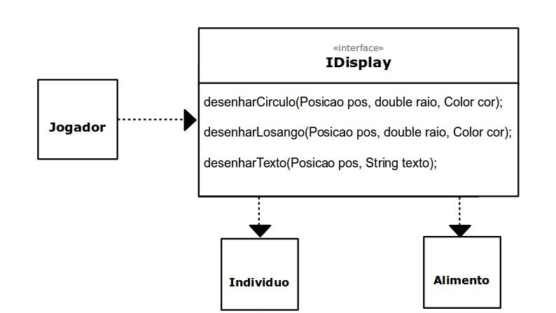
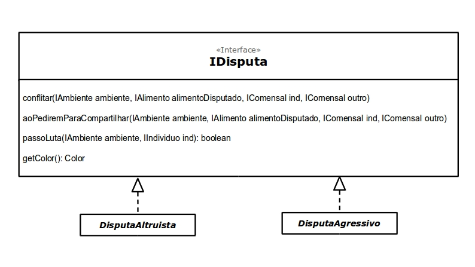

# Projeto 'Simulação Simples de Seleção Natural'
***
# Descrição Resumida do Projeto
O projeto visa criar uma simulação na qual é possivel, de forma simplificada, observar como a seleção natural agiria sobre certos indivíduos a partir de características inicialmente estabelecidas.

# Equipe
* Gustavo de Souza dos Reis - 217425
* Nicolas Bissoli Nattis - 222903

# Vídeos do Projeto

## Vídeo da Prévia
> [Descrição do projeto em vídeo](https://youtu.be/5YG_XTaacII)

## Vídeo do Jogo
> <Coloque um link para o vídeo em que é demonstrada a versão final do jogo. Esse vídeo deve ter em torno de 5 minutos. Este vídeo não apresenta slides, nem substitui a apresentação final do projeto, que será feita por conferência. Ele mostra apenas o jogo em funcionamento.>

# Slides do Projeto

## Slides da Prévia
[Apresentação do projeto](https://docs.google.com/presentation/d/1VNRqjlXSO0DlfJKghyU4DFAkQsdF8YDgi9pIIya53mk/edit?usp=sharing)

## Slides da Apresentação Final
[Apresentação Final](https://docs.google.com/presentation/d/1heejW5oTk09ieW_NVZAlWw2QEAfHzoUBBJQ8FNtxT6M/edit?usp=sharing)
## Relatório de Evolução

* A evolução e execução do projeto pode ser dividida em 3 etapas: planejamento, execução e finalização.

   * Planejamento: A etapa mais longa e talvez a mais importante, levamos cerca de 15 dias para conclui-la. Nessa etapa procuramos esclarecer exatamente os objetivos       do projeto, e quais os meios que teriamos para alcançar esses objetivos. Determinamos como seria a apresentação visual do projeto, com quais elementos o usuário  pode interagir, qual a melhor forma de realizar essas interações, quais características do sistema como um todo seriam customizaveis, e qual a melhor forma de    organizar isso. Além disso definimos quais seriam os "mecanismos internos" do projeto, quais interfaces seriam criadas, e quais componentes essas interfaces   poderiam gerar, além de como se daria a comunicação interna entre os componentes, e como se daria a comunicação externa com o usuário.
   
   * Execução: Na execução procuramos ser o mais fiel possível ao que foi planejado, porém algumas coisas tiveram que ser mudadas, e para continuar mantendo o controle, criamos um documento no qual fomos listando todas as mudanças que precisaram ser feitas no projeto original. Dessas mudanças pode-se citar a adoção de um sistema diferente de gerenciamento de propriedades, o refatoramento de alguns componentes e até mesmo de algumas interfaces.
   
   * Finalização: Nessa etapa, buscamos fazer ajustes finais ao projeto como um todo, atualizando, no planejamento, as mudanças listadas durante a execução do projeto, e fazendo testes no programa para localizar e tratar possíveis bugs.

# Destaques de Código

> <Escolha trechos relevantes e/ou de destaque do seu código. Apresente um recorte (você pode usar reticências para remover partes menos importantes). Veja como foi usado o highlight de Java para o código.>

~~~java
// Recorte do seu código
public void algoInteressante(…) {
   …
   trechoInteressante = 100;
}
~~~
***
# Destaques de Pattern

## Data Access Object Pattern

### Código do Pattern
~~~java
// Recorte do código do pattern seguindo as mesmas diretrizes de outros destaques
public void algoInteressante(…) {
   …
   trechoInteressante = 100;
}
~~~

> O Pattern em questão foi criado para padronizar as operações de acesso e modificação de dados no programa, podendo deixar essas operações acessiveis ao usuário

## Observer Pattern

### Código do Pattern
~~~java
// Recorte do código do pattern seguindo as mesmas diretrizes de outros destaques
public void algoInteressante(…) {
   …
   trechoInteressante = 100;
}
~~~

> O Pattern em questão foi criado para generalizar a ocorrência de ações durante a execução da simulação

## Composite Pattern

### Código do Pattern
~~~java
// Recorte do código do pattern seguindo as mesmas diretrizes de outros destaques
public void algoInteressante(…) {
   …
   trechoInteressante = 100;
}
~~~

> O Pattern em questão foi criado para generalizar a forma como as coisas serão apresentadas na tela do usuário

***
# Conclusões e Trabalhos Futuros

> Pode-se dizer que os objetivos iniciais do projeto foram alcançados. Criamos uma simulação na qual é possível observar como características de um certo individuo podem influenciar nas relações com outros indíviduos no mesmo ecossistema simulado, baseando-se em competição por alimentos e disputas pelos mesmos alimentos. Para melhorias futuras no projeto, gostaríamos de adicinar modelos estatísticos à simulação, para ter à mão dados mais concretos sobre a influência de certas características no tamanho total da população do ambiente, adicionando opções como plotagem de gráficos e criação de tabelas.

***
# Diagramas

## Diagrama Geral de Componentes

> 

> No diagrama apresentado, podemos ver como os componentes se comunicam entre si, e também como é feita a comunicação com o usuário

## Detalhamento Componentes

## Componente `Display`

> Componente responsável pela interface gráfica do programa.

**Ficha Técnica**
item | detalhamento
----- | -----
Classe | `<caminho completo da classe com pacotes>`   Exemplo: `pt.c08componentes.s20catalog.s10ds.DataSetComponent`
Autores | Nicolas e Gustavo
Interfaces | IDisplay

### Interfaces

Interfaces associadas a esse componente:

Interface agregadora do componente em Java:

~~~java
public interface IDisplay {
}
~~~
## Componente `Alimento`

> Tipo de objeto que fornece energia para o indivíduo e que pode gerar uma disputa

**Ficha Técnica**
item | detalhamento
----- | -----
Classe | `<caminho completo da classe com pacotes>`   Exemplo: `pt.c08componentes.s20catalog.s10ds.DataSetComponent`
Autores | Nicolas e Gustavo
Interfaces | IAlimento

### Interfaces

Interfaces associadas a esse componente:

Interface agregadora do componente em Java:

~~~java
public interface IAlimento extends IObjeto {
}
~~~

## Componente `Ambiente`

> Meio celular no qual ocorrem as interações entre os demais componentes

**Ficha Técnica**
item | detalhamento
----- | -----
Classe | `<caminho completo da classe com pacotes>`   Exemplo: `pt.c08componentes.s20catalog.s10ds.DataSetComponent`
Autores | Nicolas e Gustavo
Interfaces | IAmbiente

### Interfaces

Interfaces associadas a esse componente:

Interface agregadora do componente em Java:

~~~java
public interface IAmbiente extends IPropriedades {
}
~~~

## Componente `Casa`

> Espaço no qual pode haver um objeto ou estar vazio

**Ficha Técnica**
item | detalhamento
----- | -----
Classe | `<caminho completo da classe com pacotes>`   Exemplo: `pt.c08componentes.s20catalog.s10ds.DataSetComponent`
Autores | Nicolas e Gustavo
Interfaces | ICasa

### Interfaces

Interfaces associadas a esse componente:

Interface agregadora do componente em Java:

~~~java
public interface ICasa {
}
~~~

## Componente `Individuo`

> Um tipo de objeto no qual o projeto se baseia, sendo importante as interações entre diferentes indivíduos

**Ficha Técnica**
item | detalhamento
----- | -----
Classe | `<caminho completo da classe com pacotes>`   Exemplo: `pt.c08componentes.s20catalog.s10ds.DataSetComponent`
Autores | Nicolas e Gustavo
Interfaces | IIndividuo

### Interfaces

Interfaces associadas a esse componente:

Interface agregadora do componente em Java:

~~~java
public interface IIndividuo extends IObjeto, IComensal, IReproducao {
}
~~~

## Componentes `DisputaAgressivo DisputaAltruista`

>Componentes relacionados à disputa por um objeto, que podem ser agressivas, na qual um dos interagentes é eliminado, e altruista, na qual um dos interagentes cede o objeto disputado

[Disputa](docs/img/ComponenteDisputa.jpg)

**Ficha Técnica**
item | detalhamento
----- | -----
Classe | `<caminho completo da classe com pacotes>`   Exemplo: `pt.c08componentes.s20catalog.s10ds.DataSetComponent`
Autores | Nicolas e Gustavo
Interfaces | IDisputa

### Interfaces

Interfaces associadas a esse componente:

Interface agregadora do componente em Java:

~~~java
public interface IDisputa{
}
~~~
***
## Detalhamento das Interfaces

### Interface `IDisplay`

`Interface responsável pelo visual gráfico do programa`

~~~java
public interface IDisplay{

   public void desenharCirculo(Posicao pos, int raio, float r, float g, float b);
   public void desenharLosango(Posicao pos, int raio, float r, float g, float b);
   public void desenharTexto(Posicao pos, String texto);
   
}
~~~

Método | Objetivo
-------| --------
`desenharCirculo` | `Cria um circulo com um certo raio, em uma certa posição, com as cores dadas a partir das variáveis rgb`
`desenharLosango` | `Cria um losango com um certo lado, em uma certa posição, com as cores dadas a partir das variáveis rgb`
`desenharTexto` | `Cria um texto em uma certa posição dada`

### Interface `IPropriedades`

`Interface responsável pela definição e pela obtenção de propriedades`

~~~java
public interface IPropriedades{

   public String[] getPropriedades();
   public String getPropriedade(String nome);
   public void setPropriedade(String propriedade, String valor);
   
}
~~~

Método | Objetivo
-------| --------
`getPropriedades` | `Retorna uma lista contendo todas as propriedades`
`getPropriedade` | `Retorna o valor da propriedade passada como parâmetro`
`setPropriedade` | `Define o valor de uma propriedade`

### Interface `IObjeto`

`Generalização dos itens que compõe o ambiente celular`

~~~java
public interface IObjeto extends IPropriedade{

   public void exibir(IDisplay display);
   public void passo(IAmbiente ambiente);
   
}
~~~

Método | Objetivo
-------| --------
`exibir` | `Exibe o objeto em questão na tela do usuário, a partir dos métodos da interface IDisplay`
`passo` | `Realiza um ciclo em um dado ambiente, e atualiza o objeto conforme for definido no ciclo'

### Interface `IDisputa`

`Interface reponsável por gerir a disputa entre dos seres`

~~~java
public interface IDisputa{

   public void incitar(IDisputa outro);
   public boolean passoLuta();
   public void aoGanhar();
   
}
~~~

Método | Objetivo
-------| --------
`incitar` | `Incita outro ser para uma disputa`
`passoLuta` | `Realiza um ciclo da luta, caso haja uma'
'aoGanhar' | 'Realiza as rotinas definidas caso o ser ganhe a disputa'

### Interface `IComensal`

`Um "ser" capaz de se alimentar e de criar uma disputa com outro "ser"`

~~~java
public interface IComensal extends IPropriedades{

   public void aoTerminarDeComer(float energiaAlimento);
   public IDiputa getDisputa();
   
}
~~~

Método | Objetivo
-------| --------
`aoTerminarDeComer` | `Realiza as rotinas definidas para quando o comensal termina de consumir um alimento`
`getDisputa` | `Responsável por gerir a disputa por um alimento caso já haja um ser se alimentando'

### Interface `IAlimento`

`Um tipo de objeto que fornece energia e que pode gerar disputa`

~~~java
public interface IAlimento extends IObjeto{

   public IComensal getAlimentando();
   public void setAlimentando(IComensal c);
   
}
~~~

Método | Objetivo
-------| --------
`getAlimentando` | `Retorna um comensal que está sendo alimentado, caso não haja, retorna nulo`
`setAlimentando` | `Começa a alimentar um dado comensal. Caso já haja um comensal sendo alimentado, inicia-se uma disputa entre ambos'

### Interface `IReproducao`

`Realiza a reprodução com outro ser`

~~~java
public interface IReproducao{

   public Gene getGene();
   public int escolherParceiro(IReproducao[] x);
   public Gene aoReproduzir(IReproducao x);
   
}
~~~

Método | Objetivo
-------| --------
`getGene` | `Retorna o gene do ser que solicita a repordução`
`escolherParceiro` | `Escolhe um entre uma lista de possiveis parceiros, e retorna o seu indice na lista'
'aoReproduzir'|'Rotinas realizadas ao reproduzir, retornando o gene do ser resultante'

### Interface `IIndividuo`

`Tipo de objeto que tem as caracteristicas de um ser comensal e que pode se reproduzir`

~~~java
public interface IIndividuo extends IObjeto, IComensal, IReproducao{

   public Gene getGene();
   public int escolherParceiro(IReproducao[] x);
   public Gene aoReproduzir(IReproducao x);
   
}
~~~

### Interface `ICasa`

`Contêiner para um objeto`

~~~java
public interface ICasa{

   public IObjetos[] getObjetos();
   public void adicionar(IObjeto o);
   public void remover(IObjeto o);
   
}
~~~

Método | Objetivo
-------| --------
`getObjetos` | `Retorna os objetos presentes na casa`
`adicionar` | `Adiciona um dado objeto na casa'
'remover' | 'Remove um dado objeto da casa'

### Interface `IAmbiente`

`Interface que gere as relações entre diferentes objetos num dado despaço celular`

~~~java
public interface IAmbiente extends IPropriedades{

   public void ICasa[][] casas();
   public void mover(IObjeto i, Posicao alvo);
   public void passo();
   public void proximaRodada();
   public void reiniciar();
   
}
~~~

Método | Objetivo
-------| --------
`casas` | `Retorna as casas que compõe o ambiente`
`mover` | `Move um dado objeto para uma dada posição'
'passo' | 'Realiza um ciclo da simulação, e as rotinas relacionadas'
'proximaRodada' | 'Realiza as rotinas relacionadas a troca de rodada, que se dá após um certo número de passos'
'reiniciar' | 'Reinicia a simulação'

***

# Plano de Exceções

## Diagrama da hierarquia de exceções
   

## Descrição das classes de exceção

Classe | Descrição
----- | -----
'ErroPropriedade' | 'Engloba todas as exceções relacionadas a definição de propriedades'
'ErroPropriedadeForaDeAlcance' | 'Indica que o valor definido está fora do alcance da propriedade
'ErroPropriedadeTipoInvalido'| 'Indica que o valor definido não é de um tipo válido para aquela propriedade'
'ErroPropriedadeIniexistente'|'Indica que a propriedade definida não existe'
