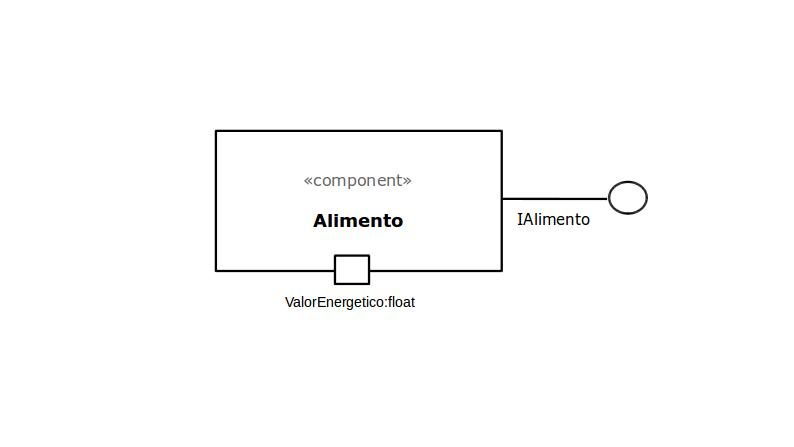
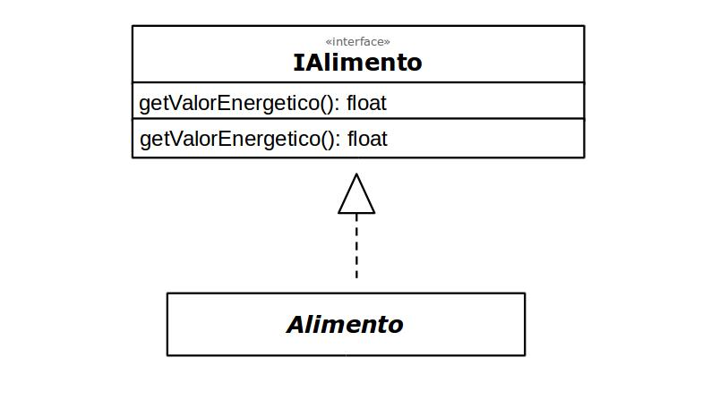

# Componente `Alimento`



Campo | Valor
----- | -----
Classe | `<caminho completo da classe com pacotes>`
Autores | `<nome dos membros que criaram o componente>`
Objetivo | Representa uma unidade de alimento na simulação.
Interface | `IAlimento`

<br>
<br>

### Interfaces

Interfaces associadas a esse componente:



```
public interface IAlimento {
    public float setValorEnergetico();
    public float getValorEnergetico();
}
```
<br>
<br>

## Detalhamento das Interfaces

<br>

### Interface `IAlimento`

Interface para passar as características genéticas do indivíduo adiante.

Método | Objetivo
------ | --------
`getValorEnergetico` | Retorna o valor energético do alimento.
