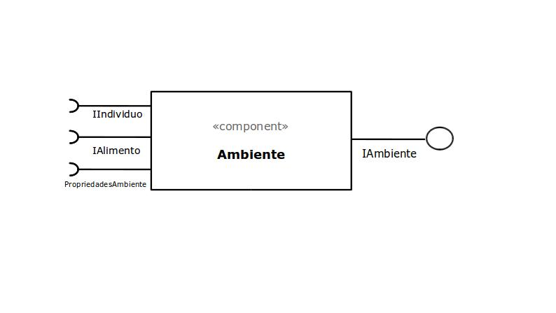
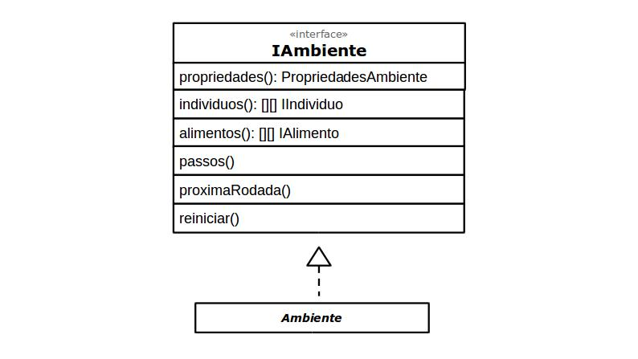

# Componente `Ambiente`



Campo | Valor
----- | -----
Classe | `<caminho completo da classe com pacotes>`
Autores | `<nome dos membros que criaram o componente>`
Objetivo | Representa o ambiente de simulação.
Interface | `IAmbiente`

### Interfaces

Interfaces associadas a esse componente:



```
public interface IAmbiente {
    public PropriedadesAmbiente propriedades();

    public IIndividuo[][] individuos();
    public IAlimento[][] alimentos();

    public void passo();
    public void proximaRodada();
    public void reiniciar();
}
```

## Detalhamento das Interfaces

### Interface `IAmbiente`

Interface para passar as características genéticas do indivíduo adiante.

Método | Objetivo
------ | --------
`propriedades` | Retorna a classe de [propriedades do ambiente](PropriedadesAmbiente.md).
`individuos` | Retorna a grade de indivíduos.
`alimentos` | Retorna a grade de alimentos.
`passo` | Realiza um passo de lógica de simulação.
`proximaRodada` | Pula para a próxima rodada.
`reiniciar` | Reinicia o ambiente.
